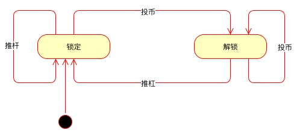

## 概念

FSM, Finite State Machine 有限状态机，是一种数学计算模型，在任意给定的时刻只会存在在给定的有限状态中的一个。FSM 会在特定的外部输入条件下发生从一个状态到另一状态的改变，这个过程叫状态转移（transition）。

一个 FSM 由以下部分构成：

- 状态表（a list of its states）
- 初始状态（Initial state）
- 每个转移的条件（the conditions for each transition）

另外，在自动机理论中，FSM 也叫做 DFA（Deterministic Finite Automaton, 确定性有限自动机），与 NFA（Nondeterministic Finite Automaton, 非确定性有限自动机）相对。DFA 的特点是：

- 每个状态转移由当前状态和输入唯一确定；
- 每次状态转移都要读取输入。

##  描述

### 状态转移表（State Transition Table）

| 当前状态→  条件↓ | 状态A | 状态B | 状态C |
| --------------------- | ----- | ----- | ----- |
| 条件X                 | …     | …     | …     |
| 条件Y                 | …     | 状态C | …     |
| 条件Z                 | …     | …     | …     |

状态转移表描述了当某个状态下触发某个条件会达到什么状态。下面以投币式旋转门为例：

| 当前状态→  条件↓ | 锁定 | 解锁 |
| --------------------- | ---- | ---- |
| 推动旋转杠            | 锁定 | 锁定 |
| 投币                  | 解锁 | 解锁 |

### UML 状态机（UML State Machines）

使用 UML 语言在 [draw.io](https://draw.io) 上绘制上述的投币式旋转门的状态图如下：

## 参考

- [Finite-state mathine - wikipedia](https://en.wikipedia.org/wiki/Finite-state_machine)