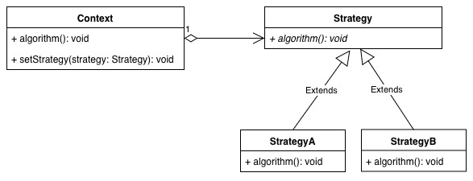
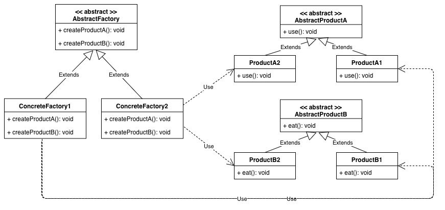
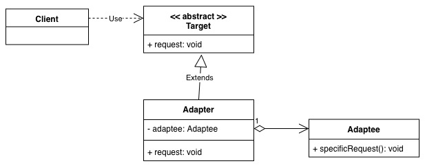
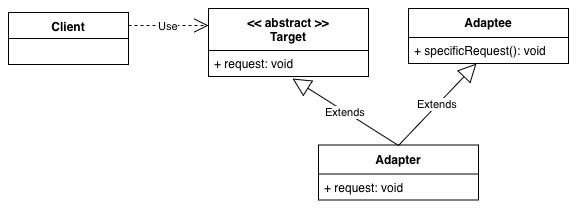

### 策略模式（Strategy Pattern）

#### （1）适用场景

当解决问题的方法有多种方式，需要可替换时。

#### （2）核心

使用组合，封装成一个个算法，即是策略。

#### （3）类图

### 抽象工厂模式（Abstract Factory Pattern）

#### （1）适用场景

1. 产品有**不同的提供商**，不同的提供商提供不同品牌和风味的产品；
2. 同一提供商有**不同的流水线**，不同的流水线生产不同的产品。

#### （2）核心

从创建开始就对产品进行了区分，生而不同。

#### （3）类图

### 适配器模式（Adapter Pattern）

#### （1）适用场景

将外部服务融合进内部而外部接口与现有服务不兼容（表现在命名、返回值、入参等不同），需要进行适配才能使用时。

#### （2）核心

使用组合或者多继承，包装旧接口到包装类（或称为适配器）中。使用组合的称之为对象适配器，使用多继承的称之为类适配器。

#### （3）类图

### 参考（Reference）

1. [图说设计模式](https://design-patterns.readthedocs.io/zh_CN/latest/index.html)
2. Head First 设计模式

