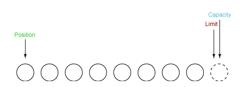
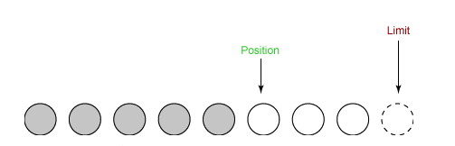
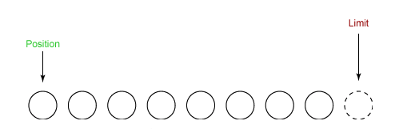

## 概念（NIO vs BIO）

NIO, Non-blocking I/O, 非阻塞式 I/O 模型。也可以解释为 New I/O, 区别于旧的阻塞式 I/O 模型（BIO）。

BIO 与 NIO 的区别如下：

| 类别 | I/O 方式 | 最低可用的 JDK 版本 |
| ---- | -------- | ------------------- |
| BIO  | 流式     | JDK 1.0             |
| NIO  | 块式     | JDK 1.4             |

所谓流式处理，就是单个字节的数据移动，通过一个称为 Stream 的对象一次移动一个字节；而块式处理，就是单个字节数组的数据移动，通过一个叫 Buffer 的对象一次移动一个字节数组。JDK 中的 NIO 库已经集成了原来的标准 I/O 功能。

## 缓冲区和通道（Buffer & Channel）

NIO 中的缓冲区（Buffer）实质是一个数组，通常为字节数组（ByteBuffer），用作读写缓冲，以及对数据的结构化访问，还可以用来跟踪系统的读写进程。

Buffer 类型：

- ByteBuffer
- CharBuffer
- ShortBuffer
- IntBuffer
- LongBuffer
- FloatBuffer
- DoubleBuffer

NIO 中的通道（Channel）类似 BIO 中的流（Stream），但是是双向的，可以用来读、写或者同时读写。流之所以是单向的，是因为一个 Stream 要么是 InputStream，要么是 OutputStream，不能兼有。

## 缓冲区内部细节（Buffer Internals）

### 状态变量（State Variables）

- Position，表征读了或写了多少数据到数组中，指向下一个元素的位置；
- Limit，表征剩余可读或可写的的数据量，初始情况下 Limit = Capacity。
- Capacity，表征 Buffer 的最大容量。

三者关系：Position <= Limit <= Capacity

下面从微观角度观察各状态变量在读写操作中的变化：

（1） Init

初始状态下，Position 指向第一个元素的位置，Limit 和 Capacity 指向最后一个元素的下一个虚拟元素的位置。由于 Capacity 保持不变，下面的讨论中予以略过。



（2）Channel.read

读取 5 个元素到缓冲区后，Position 指向第六个元素的位置，Limit 不变。



（3）Buffer.flip

进行 Flip 操作后，Limit 指向当前的 Position 的位置，Position 指回第一个元素的位置，


（4）Channel.write

从缓冲区读取 5 个元素写入 Channel 后，Position 指向 Limit 所在的位置。


（5）Buffer.clear

clear 后缓冲区重置到初始状态。



### 存取方法（Accessor ）

存取方法分为：

- 相对方法（Relative Method）：在当前 position 进行读写操作，随后 position 自增1。
- 绝对方法（Absolute Method）：在某个索引位置进行读写操作，不影响 position 和 limit。

（1）get 系列方法（包括 `array()` )，用于读取缓冲区的数据，其中 `byte get(int index)`  为绝对方法。

（2）put 系列方法，用于写入数据到缓冲区，其中 `ByteBuffer put(int index, byte b)` 为绝对方法。

## 使用（Show U the Code）

### 读取文件

1. 从 FileInputStream 中获取 Channel；
2. 创建 Buffer；
3. 将数据从 Channel 读到 Buffer 中。

示例如下：

```java
// 将 a_file 读到 StringBuilder 中
FileInputStream fin = new FileInputStream("/path/to/a_file");
FileChannel fc = fin.getChannel();

ByteBuffer buffer = ByteBuffer.allocate(1024);
StringBuilder sb = new StringBuilder();
while (fc.read(buffer) != -1) {
    sb.append(new String(buffer.array(), 0, buffer.position()));
}
```

### 写入文件

1. 从 FileOutputStream 中获取 Channel；
2. 创建 Buffer；
3. 写入数据到 Buffer；
4. 将数据从 Buffer 写入 Channel 中。

示例如下：

```java
// 将 "Something" 写入 a_file 中
FileOutputStream fos = new FileOutputStream("/path/to/a_file");
FileChannel fc = fos.getChannel();

ByteBuffer buffer = ByteBuffer.allocate(1024);

byte[] content = "Something".getBytes();
for (byte aContent : content) {
    buffer.put(aContent);
}
buffer.flip();

fc.write(buffer);
```

### 边读边写

1. 清除 Buffer；
2. 从输入流的 Channel 读数据到 Buffer；
3. 写入 Buffer 中的数据到输出流的 Channel；
4. 循环直到输入流的 Channel 中没有数据。

示例如下：

```java
FileInputStream fin = new FileInputStream("path/to/in_file");
FileOutputStream fout = new FileOutputStream("path/to/out_file");

FileChannel fcin = fin.getChannel();
FileChannel fcout = fout.getChannel();

ByteBuffer buffer = ByteBuffer.allocate(1024);

while (true) {
    buffer.clear();
    int r = fcin.read(buffer);
    if (r == -1) {
        break;
    }
    buffer.flip();
    fcout.write(buffer);
}
```

## 参考

- [NIO 入门 - IBM](https://www.ibm.com/developerworks/cn/education/java/j-nio/j-nio.html)
- [Getting started with new I/O (NIO) - IBM](https://www.ibm.com/developerworks/java/tutorials/j-nio/j-nio.html)