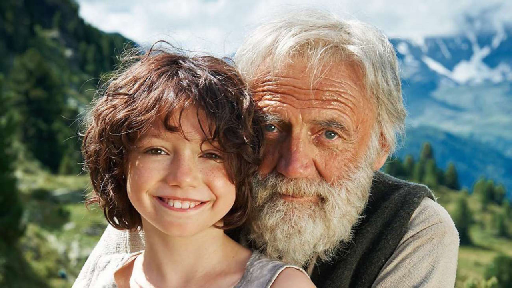

```
导演: 阿兰·葛斯彭纳
编剧: 约翰娜·施皮里 / 佩特拉·比翁迪娜·沃尔普
主演: 阿努克·斯特芬 / 布鲁诺·甘茨 / 昆林·艾格匹 / 安娜·申茨 / 伊莎贝尔·奥特曼 / 更多...
类型: 剧情 / 家庭 / 冒险
官方网站: www.heidi.studiocanal.de
制片国家/地区: 德国 / 瑞士 / 南非
语言: 德语 / 瑞士德语 / 南非语
上映日期: 2015-12-10(德国)
片长: 111分钟
又名: 飘零燕(港) / 海蒂 / 阿尔卑斯山少女海蒂
IMDb链接: tt3700392
```

海蒂，一个瑞士小女孩，父母双亡，由姨妈带大。后来姨妈想要去法兰克福工作，不能再带海蒂了，于是把她带到她爷爷住的山上。爷爷是一个性情冷淡的老人，邻居都不敢靠近他，甚至流言说他杀过人。爷爷不肯接纳海蒂，但是姨妈已经弃海蒂而去了。尽管爷爷心里抗拒，关闭了房门，可海蒂已经跳进羊圈跟小羊度过了第一天。慢慢地，爷爷接纳了海蒂，让她睡阁楼的草垫上，还给她做了一把小木椅。海蒂也融入了爷爷阿尔卑斯山里自由自在的生活，认识了小牧羊人皮特，并成为了好朋友。

有一天，海蒂的姨妈又来了，骗走了海蒂，把她卖给了法兰克福一个富裕人家，给他们的小姐克拉拉做玩伴。“粗鲁”的海蒂要遵守各种繁文缛节，常常闹出笑话，给孤独而且双脚不便的克拉拉带来了很多欢乐。克拉拉的奶奶还给海蒂读故事书，海蒂很喜欢，可是奶奶读了不到一半就停了，告诉海蒂想知道后面的故事，要认字。于是，海蒂认真地听私人教师的课。没多久就学会了念读故事书，大家都很高兴。但海蒂心里一直想着阿尔卑斯山、爷爷、皮特还有山羊，还因此梦游去开门，风吹门发出奇怪的声音，大家都以为是闹鬼了。主人家的医生发现后建议主人送她回家以免积郁成疾。尽管克拉拉不肯而发脾气，主人也不情愿，但还是送海蒂回到了阿尔卑斯山。

海蒂又回到了故乡，那人，那山，那山羊，心里无限欢快。海蒂写信给克拉拉，告诉她这里的生活，要她过来这里看看。克拉拉的奶奶把信读给克拉拉听了。不久，她们就来到了海蒂身边，两人紧紧拥抱，笑容可掬。奶奶留下了克拉拉几天，跟着海蒂一起在大山里玩耍。这时皮特不乐意了，因为他觉得海蒂好像被克拉拉抢走了。于是，在一天早上，把克拉拉的轮椅推向了山谷。这一天，爷爷背着克拉拉，海蒂在后面，一起去放羊。克拉拉坐在石头上，一只蝴蝶落在她的脚上，她伸手去抓，蝴蝶飞起来了，她站起来想要去抓。是的，她站起来了！海蒂和皮特搀扶着她，每天练习走路。在他爸爸来接她的时候，她缓步走向她爸爸，她爸爸和奶奶感动得眼泪夺眶而出，抱起了克拉拉。克拉拉回家了。海蒂和爷爷，也回家了。他们春天放羊，冬天滑雪橇。