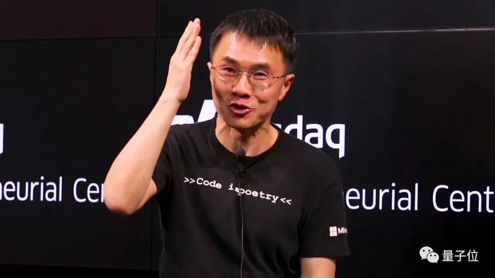

## 陆奇简历

- 1987年，毕业毕业于复旦大学，获计算机科学学士、硕士学位。
- 1992年，就读于卡耐基梅隆大学，获计算机科学博士学位。
- 1998年8月，陆奇加入雅虎公司，2007年晋升为雅虎执行副总裁。
- 2008年8月，陆奇离开雅虎，并于次年1月正式加盟微软任网络服务集团总裁，2013年出任微软集团全球执行副总裁，2016年9月宣布从微软离职。
- 2017年1月17日加入百度，担任百度集团总裁兼首席运营官、百度董事及董事会副主席 ，主要负责百度的产品、技术、销售及市场运营，兼任百度智能驾驶事业群组总经理。
- 2018年5月17日，百度发布内部全员邮件，宣布集团总裁兼首席运营官陆奇由于个人和家庭原因，无法继续全职在北京工作，将从7月起不再担任上述职务，但仍将继续担任集团公司副董事长。

##  陆奇选择百度的标准

1. 能够承载陆奇的只有巨头或拥有巨头前景的公司，而且要有全球化雄心；
2. 陆奇需要一个COO/总裁级别的职位来匹配他的地位和抱负，并且足够放权让他施展；
3. 最好还是一家技术驱动，工程师驱动的公司。

## 陆奇出入，百度股价情况

自陆奇进入百度工作至今，百度股价累计涨幅接近60%。百度2018年第一季度财报显示，本季度百度营收为209亿元人民币（约合33.3亿美元），同比增长31%，其中移动营收占比78%；净利润为人民币67亿元（约合11亿美元），与上年同期相比增长277%。

本周三（5月16日）时，百度股价还大涨了4.47%，创下历史新高，市值达985亿美元，眼见即将破千亿美元大关。

然而随着陆奇突然离职，百度下重注的All-in AI战略顿时蒙上了许多阴影。受此消息影响，百度股价暴跌9.54%，收报253.01美元，市值882亿美元，一夜蒸发94亿美元。

5月19日，同期腾讯市值为4917.99亿美元，阿里市值为5010.48亿美元。

## 引用

> 但可能在今年年内某一天，这个“副董事长”的title就会宣布卸去。而陆奇肯定也不好因此归隐退休，**他才57岁，而且依然为高强度工作而4点起床锻炼身体**，更主要的是他满怀一腔雄心和抱负，看好中国科技的高速发展进程，也对带领中国公司成为国际化巨头深怀期待。  — 量子位

## 我的感悟

陆奇先生是一个有大抱负的人，而且又很坚毅，这是他有而我没有的可贵品质，也是我一直很想成功但没有成功的最大原因，我做事嫌累，容易放弃，所以才落到如此境界。

## 参考

- [陆奇失陆，造化由李 - 量子位](https://mp.weixin.qq.com/s/5k9sZzGZ887Hhg8hQe_FIA)

