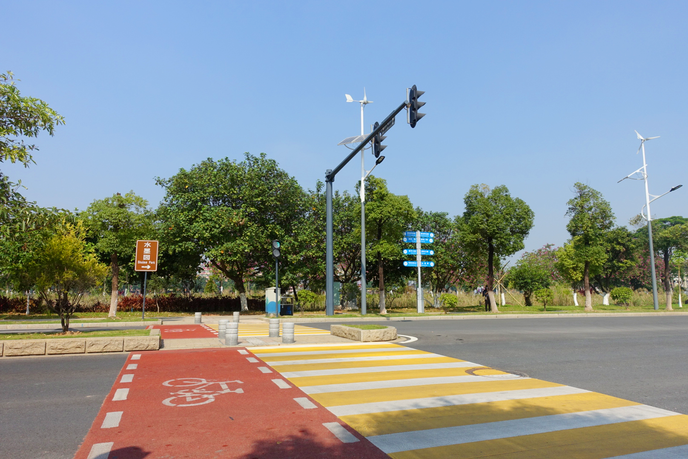
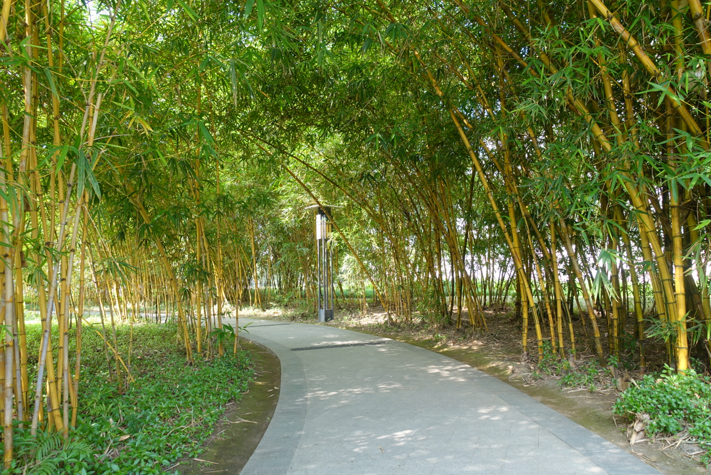
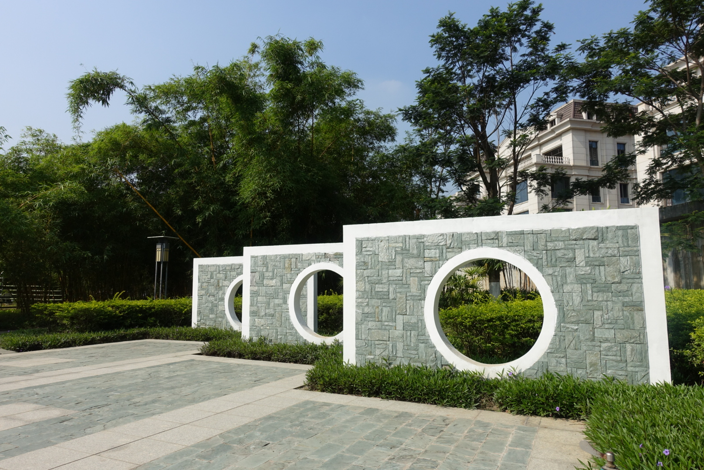

| KEY      | VALUE                      |
| -------- | -------------------------- |
| 地点     | 广州生物岛（官洲岛）       |
| 景点     | 水墨园、叠翠园、空旷的道路 |
| 时间     | 2018年 11月 24日 上午      |
| 气候     | 阳光明媚，温度 25°C        |
| 设备     | Sony RX100 Ⅲ               |
| 主题     | 冬天在哪里？               |
| 照片数量 | 8/99                       |

###  路（Road）

#### （1）车道-人行道-水墨园

生物岛的斑马线是黄白交替的，旁边有如红色地毯的自行车道，另外还有环岛的蓝色自行车道。

| PS           | WHY                              |
| ------------ | -------------------------------- |
| 增强了饱和度 | 拍摄时太亮，导致黄色和红色不明显 |

#### （2）竹林小道

水墨园里有一片竹林，风吹竹曳，可以解暑气。

| PS   | WHY  |
| ---- | ---- |
| 无   | 无   |

#### （3）生锈的水栓 - 活动的机器人

路边看到一锈迹斑斑的水栓，看起来好似一活动的机器人正在分析路况。

| PS    | WHY |
| ---------- | ------------ |
| 增强了亮度 | 拍摄时逆光了 |

#### （4）清道夫的单车装备

道路旁边放着一辆上了锁的单车，车篮放着一顶草帽，货架延伸出一个箩筐，放着扫帚之类的清道工具，装备齐全。

| PS   | WHY  |
| ---- | ---- |
| 无   | 无   |

### 水墨园（Shuimo Park）

#### （1）建设-完工

水墨园两边的建筑，一边还在雏形还没建好，一边已经完工了。

| PS                                                | WHY                    |
| ------------------------------------------------- | ---------------------- |
| 一分为二，左边使用黑白+黄色色调处理，右边不做处理 | 增强建设中和完工的对比 |

#### （2）屏风 - 人家

水墨园里，接近别墅区的地方有一处做了屏风处理，感觉很是相宜。

| PS   | WHY  |
| ---- | ---- |
| 无   | 无   |

#### （3）奇怪的建筑

水墨园旁边有一处奇怪的建筑，两边伸出像手臂一样的铁疙瘩，主体部分好像损毁的斗兽场，目前还在维护。

| PS   | WHY  |
| ---- | ---- |
| 无   | 无   |

### 中国海警（Chinese Maritime Police）

在水墨园偶然间听到军队嘹亮的歌声，往岛边一望，原来是中国海警舰艇的身影，穿着白色 T 恤，肩上有红蓝条纹，前额很尖。

| PS         | WHY          |
| ---------- | ------------ |
| 增强了亮度 | 拍摄时逆光了 |